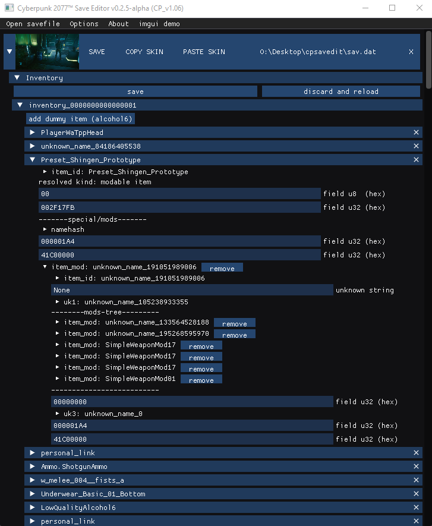

# CyberpunkSaveEditor
A tool to edit Cyberpunk 2077 sav.dat files

Join the CP modding discord: https://discord.gg/cp77modding

Take a look at the other save editor project: https://github.com/WolvenKit/CyberCAT

# What works
1) load, save node tree
2) mini hexeditor for nodes data (can change node data size)
3) search tools (string, crc32(namehash) of string, u32, float double, from hexeditor clipboard)
4) [experimental] copy/paste skin blob between saves
    (this can fail for unknown reasons yet between fresh save and high-level save)
5) inventory editor (most fields are still obscure and some item names are not resolved)
6) can unflag all quest items to make them normal items
7) can add stat modifiers to items!
8) can edit the scriptables data in system nodes.

# Preview

# Roadmap
1) Code cleaning
2) Work on github issues
