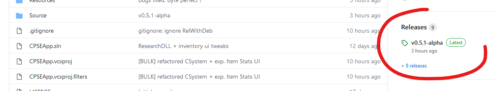

To read about the game vulnerability (patched in v1.12): https://github.com/PixelRick/CyberpunkSaveEditor/blob/main/XPLOIT.md

# CyberpunkSaveEditor
A tool to edit Cyberpunk 2077 sav.dat files (join the CP modding discord: https://discord.gg/cp77modding)

This is a holidays project and will probably not reach the user-friendly GUI state that a save editor is expected to have.

If you are looking for an intuitive editor, please take a look at the other save editor project made by a group of C# developers on the CP modding discord:
- https://github.com/Deweh/CyberCAT-SimpleGUI (forked from https://github.com/WolvenKit/CyberCAT).

# Install
To download CPSE as an executable, please click on Releases in the right pane as shown in this screenshot:

# What works
1) load, save node tree
2) mini hexeditor for nodes data (can change node data size)
3) search tools (string, crc32(namehash) of string, u32, float double, from hexeditor clipboard)
4) [experimental] copy/paste skin blob between saves
    (this can fail for unknown reasons yet between fresh save and high-level save)
5) inventory editor (most fields are still obscure and some item names are not resolved)
6) can unflag all quest items to make them normal items
7) can add stat modifiers to items!
8) can edit the scriptables data in system nodes.

# Preview

# Roadmap
1) Code cleaning
2) Work on github issues
